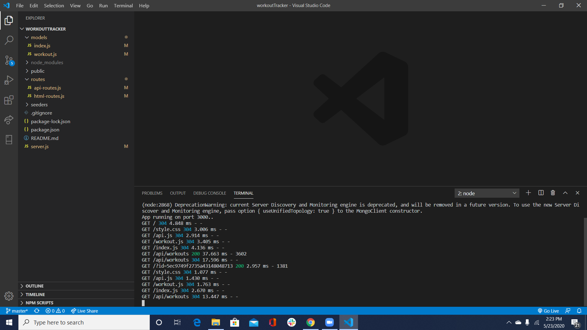
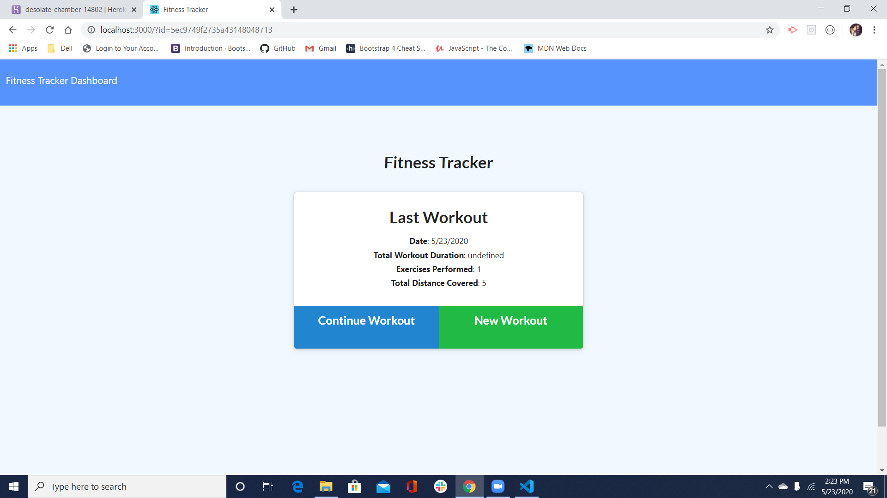
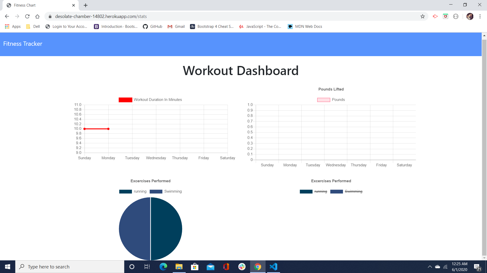

# workoutTracker

This is an app that will help an individual keep track of their workouts. They will be able to create their own workout regimine, 
by customizing exactly what kind of workouts they want to focus on. It will keep track of their progress through the dashboard. 

# User
AS A fitness enthusiast
I WANT to be able to log and track my workouts daily
SO THAT I maintain my fitness goals

Link to Heroku: https://desolate-chamber-14802.herokuapp.com/

Link to GitHub: https://github.com/sylviadiane69/workoutTracker

 
 

